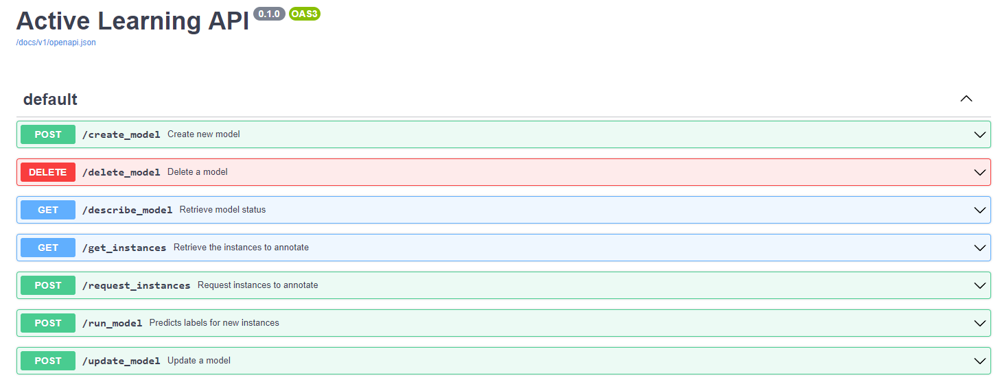

# FASL: A platform for Few-Shot Active Learning Appendix

## Label Descriptions

Label description (also called hypotheses) used for various datasets can be found here:

[tables/label_texts.md](tables/label_texts.md)

## Additional Plots

Additional plots can be found here:

[plots.md](plots.md)

## Additional Results

Additional results for all methods can be found here:

[results.md](results.md)

## Additional Meric Plots

Additiona plots showing how the unsupervised metrics perform on different datasets:

[metric_plots.md](metric_plots.md)

## Additional Plots on F1 Prediction

Additiona plots on the prediction of the test F1:

[f1_prediction.md](f1_prediction.md)

## Active Learning API

The following figure shows the endpoints the API:

