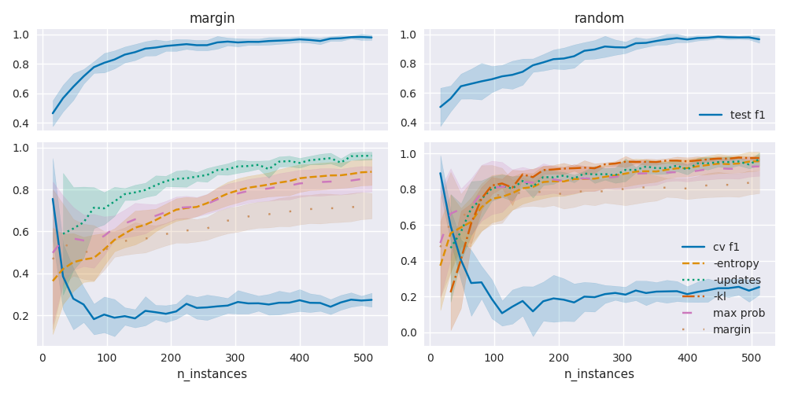
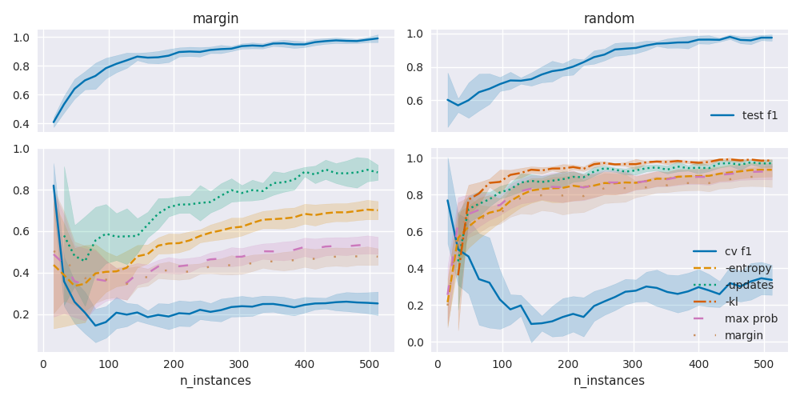
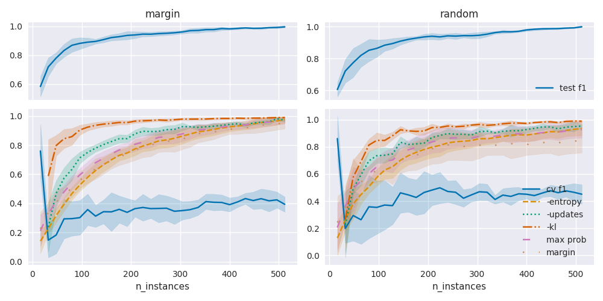
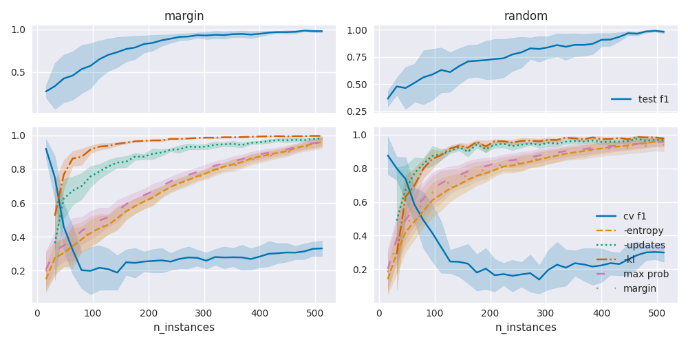

## Additional Plots on the prediction of the test F1

### LR ag_news_ub

### LR azn-de

### LR azn-de_ub

### LR azn-en

### LR azn-en_ub

### LR azn-es

### LR azn-es_ub

### LR gnad

### LR gnad_ub

### LR hate

### LR hqa

### LR hqa_ub

### LR solid

