# Additional Plots

## ag_news

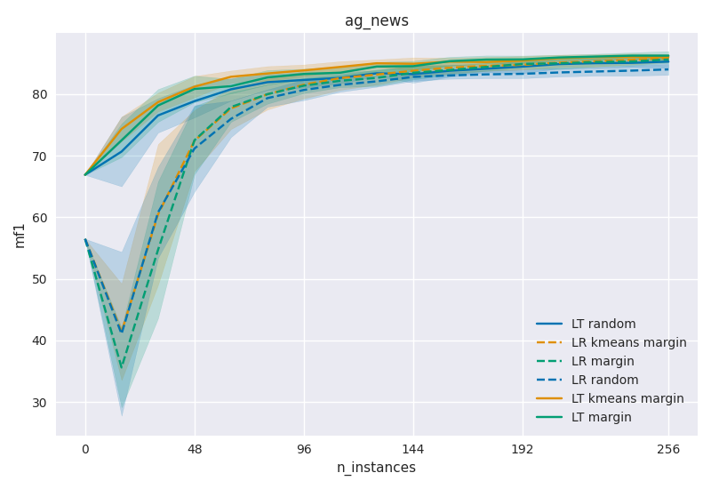

## ag_news ub

## azn-de

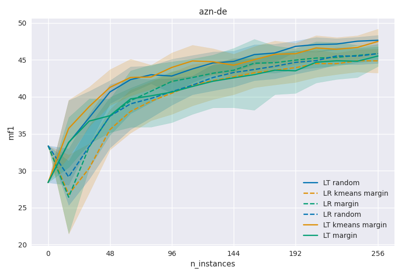

## azn-de ub

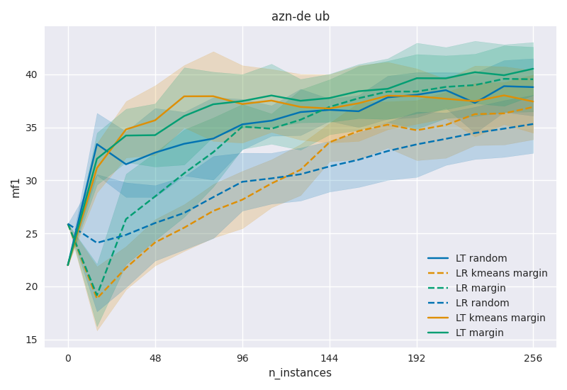

## azn-en

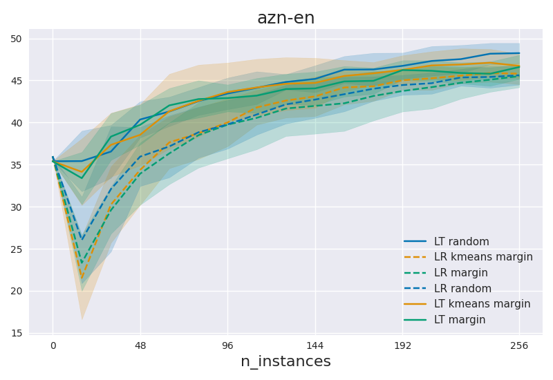

## azn-en ub

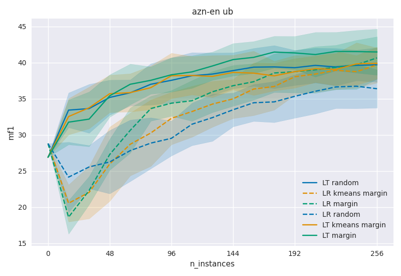

## azn-es

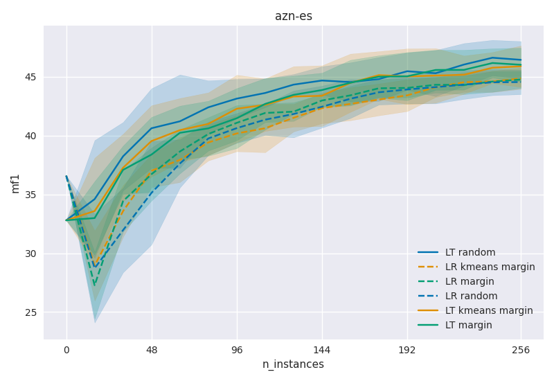

## azn-es ub

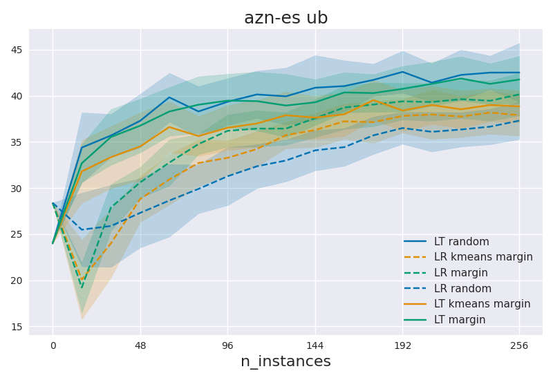

## gnad

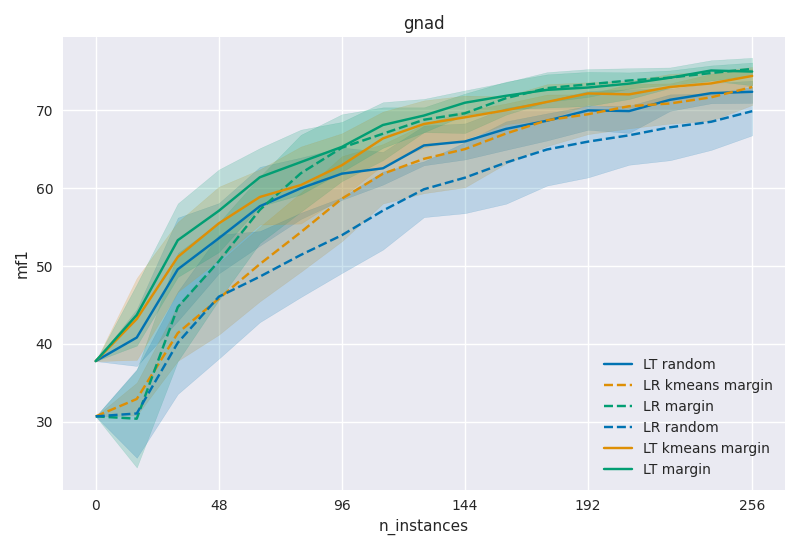

## gnad ub

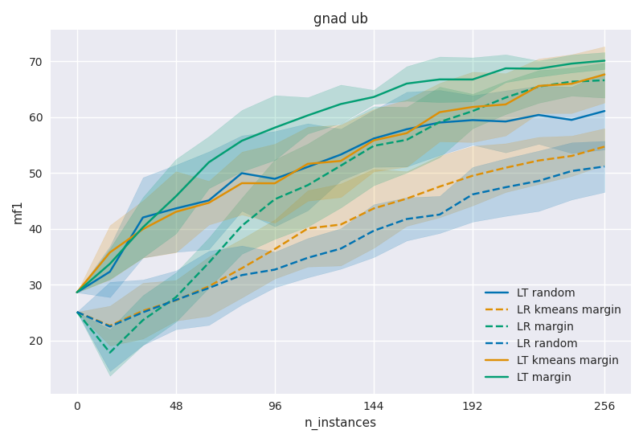

## hate

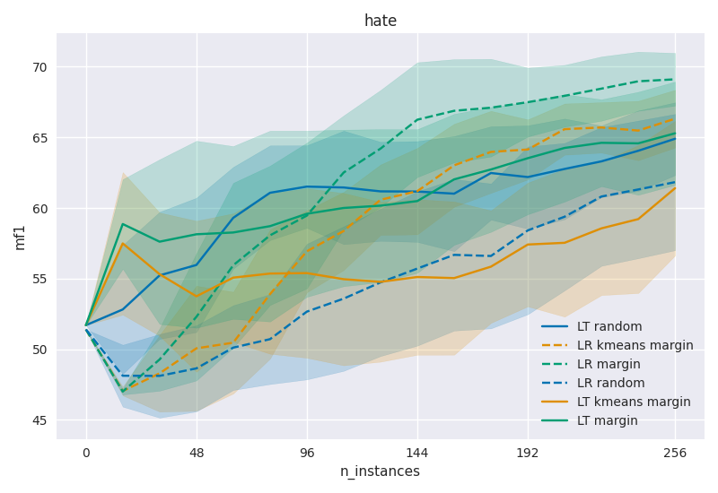

## hqa

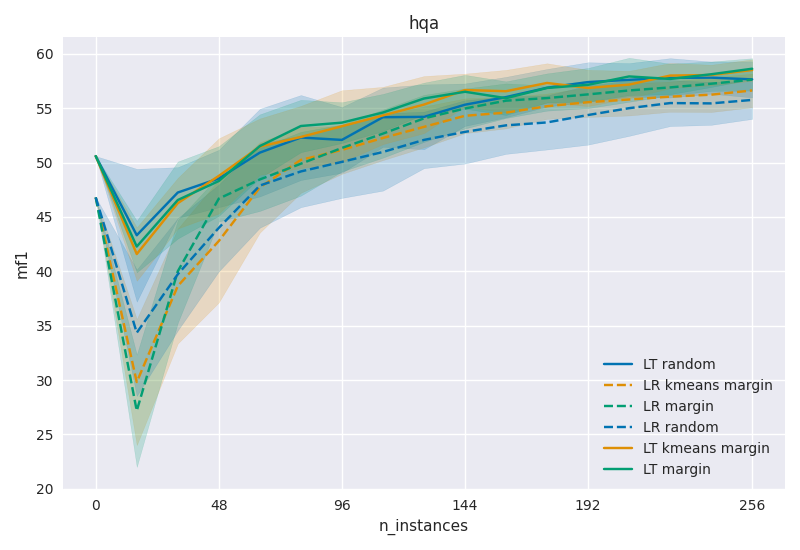

## hqa ub

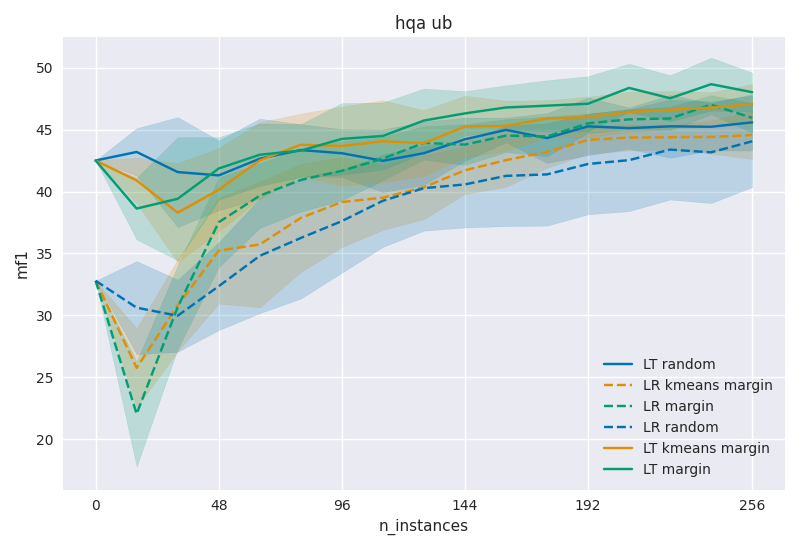

## solid

