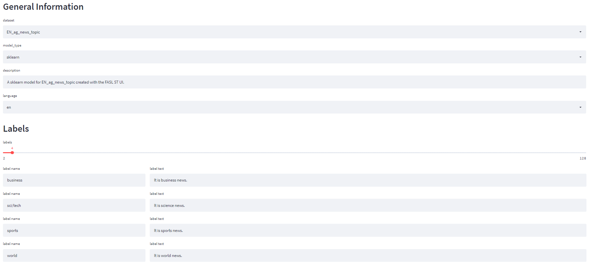
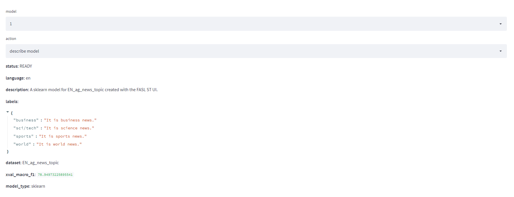
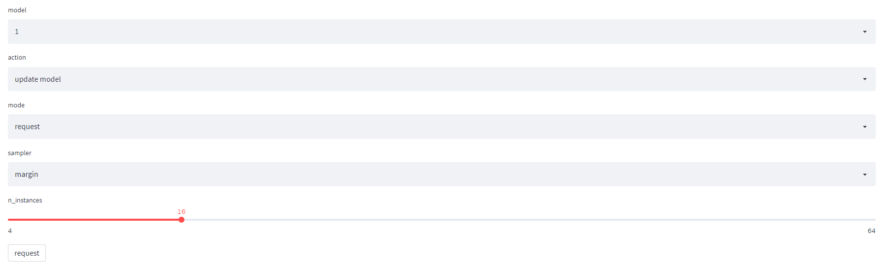
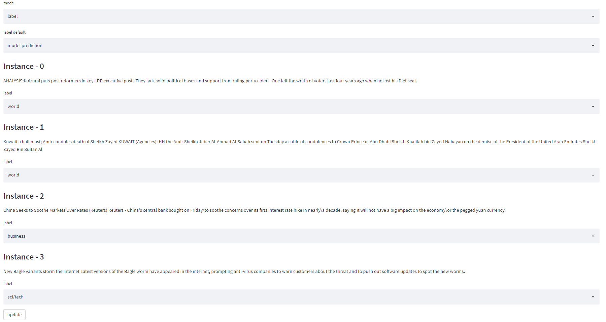
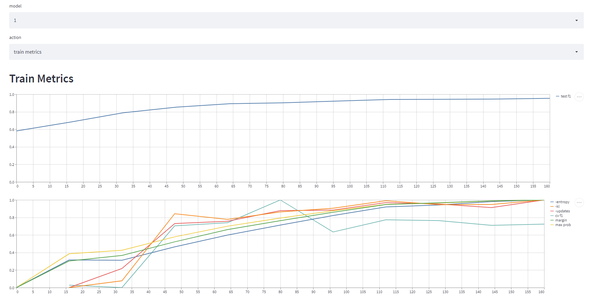
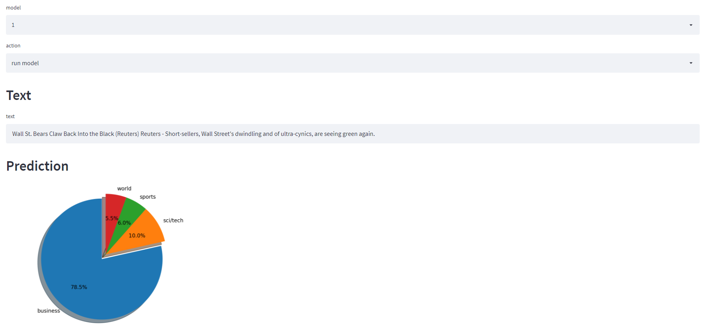

# REST API

The following figure shows the endpoints the API:

# UI

The UI is implemented in [streamlit](https://streamlit.io/).

## Create Model

The user selects a built-in dataset or uploads their own data.
They also specifiy the label set and descriptions to use.
Optionally they can provide labeled examples.

## Description

The description page shows the model details.

## Request Instances

The user can select an Active Learning method and the number of instances to retrieve.

## Update Model

Once the instances are retrieved they are annotated by the user.
"update" triggers model re-training.

## Train Metrics

The train metrics help the user to decide when they have annotated enough.
The test F1 curves provides the estimated normalized F1.
That is 0.95 means that the model has reached 95% of the quality that it will ever reach.

## Run Model

Finally the user can use the model for inference.
(The platform also provides a REST API for programmatic infererence.)

